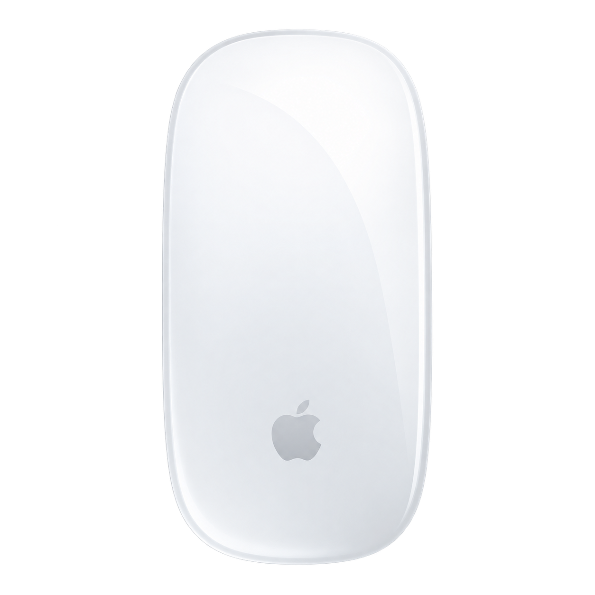

<h1 align="center">Magic Mouse for Windows</h1>

Tu Magic Mouse en Windows, con una experiencia cuidada.

Soy Sebastian Ardila. Creé esta app gratuita para aprovechar mejor nuestro Magic Mouse en Windows. Si te sirve, puedes apoyar el proyecto con una estrella, compartirlo o proponer una mejora.

## Instalar

Requiere **Windows 10 (19041+) o Windows 11, x64**.

1. [Descarga el ZIP para Windows](https://github.com/SebastianArdila-Dev/Magic-Mouse-For-Windows/releases/tag/v0.3.1-preview).
2. Extrae la carpeta completa y abre `MagicMouse.Windows.App.exe` o `Instalar.cmd`.
3. Arrastra el logo a **Aplicaciones** o pulsa **Instalar y continuar**. También puedes elegir **Usar sin instalar**.
4. Completa las preferencias y pulsa **Finalizar**. Empareja el mouse en Bluetooth cuando lo tengas.

No necesitas instalar .NET ni ejecutar como administrador. Conserva todos los archivos del ZIP: los DLL y las carpetas de idiomas son dependencias de la aplicación.

## Funciones

- Temas claro, oscuro y del sistema.
- Ajustes de puntero, velocidad, botones y desplazamiento.
- Configuración de gestos y simulador local.
- Perfiles por aplicación, guardados en tu usuario.
- Batería cuando Windows proporciona el dato.
- Funcionamiento en la bandeja al cerrar la ventana y reintentos de lectura del dispositivo.

**Versión preliminar:** los gestos físicos requieren acceso HID y todavía necesitan pruebas con un Magic Mouse real. No se incluye un controlador táctil firmado. Sigue pendiente una discrepancia del tamaño del cursor en algunos controles. Consulta [las limitaciones](KNOWN_LIMITATIONS.md).

## Datos y desinstalación

La app no pide una cuenta ni envía telemetría. Guarda ajustes y diagnósticos localmente en `%LOCALAPPDATA%\MagicMouseForWindows`. Los diagnósticos pueden contener rutas e identificadores del dispositivo; revísalos antes de compartirlos.

Para desinstalar, desactiva **Iniciar con Windows**, sal desde la bandeja y elimina `%LOCALAPPDATA%\Programs\MagicMouseForWindows` y su acceso del menú Inicio. Borra la carpeta de ajustes solo si también quieres perder tus preferencias.

## Desarrollo

C#, .NET 8 y WinUI 3. [Cómo compilar, probar y empaquetar](BUILDING.md).

`src/` contiene la app; `tests/` conserva las pruebas del núcleo usadas en la compilación automática. No se incluyen en el ZIP instalable. Los informes de pruebas, capturas de diagnóstico, configuraciones personales y herramientas internas de QA quedan fuera de la distribución.

Para reportar un problema, abre un issue con tu versión de Windows, modelo del mouse y pasos para reproducirlo. No adjuntes contraseñas ni datos privados.

[GitHub · SebastianArdila-Dev](https://github.com/SebastianArdila-Dev) · [X · SebastianardSWE](https://x.com/SebastianardSWE)

Código bajo [MIT](LICENSE). [Licencias de dependencias](THIRD_PARTY_LICENSES.md). Proyecto independiente, sin afiliación con Apple.
